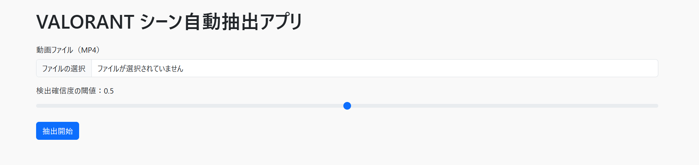
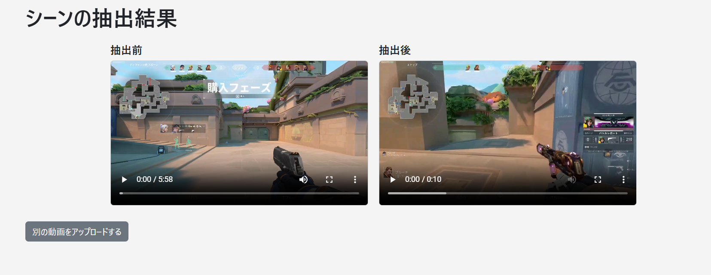

# VALORANT シーン自動抽出アプリケーション

このアプリケーションは、チーム対戦型FPSゲーム「VALORANT」のプレイ動画から特定のシーンを自動抽出する機能を提供します。OpenAIのCLIPを再実装したオープンソース版「OpenCLIP」を活用し、自然言語を用いた柔軟なシーン分類の実現を目指しています。

## 目的

本プロジェクトは、**eスポーツにおけるプレイ動画から特定のシーン（例：キルシーン）を自動抽出**することで、チームや個人による試合分析や、大会ハイライトの効率的な生成に貢献することを目的としています。

## 期待される成果

- **CLIPベースの画像分類モデルを採用し、未知のデータに対する汎用性を向上**  
  従来のCNNやViTベースのモデルに比べて、CLIPは多様な画像・言語表現を事前学習しており、eスポーツ特有の複雑なシーンに対しても柔軟な分類が期待されます。

- **自作のラベル付きデータセットによるファインチューニングで検出精度を向上**  
  公開データが存在しないVALORANTの試合映像を対象に、フレーム単位で手動アノテーションを行い、自作データを用いてCLIPモデルをファインチューニングしました。

- **Webアプリケーション上で一貫した処理体験を提供**  
  ユーザが動画をアップロードすると、サーバー側で対象のシーン（例：キルシーン）を自動抽出し、その結果をブラウザ上で比較・再生できるUIを構築。実運用に近い形での体験を可能としています。

- **将来的な拡張性への対応**  
  ユーザが独自にプロンプトや分類カテゴリを設定できるような構造とし、多様な競技タイトルや用途に応じてカスタマイズ可能な拡張性のあるシステムを目指しています。

## 機能概要

### 主な機能
- 動画のアップロード
- 検出確信度の閾値調整
- シーンの自動抽出
- 抽出結果のプレビュー

### モデル学習に関する機能
- OpenCLIPモデルのファインチューニング
- カスタムデータセットを用いた学習プロセス
- 最適なモデルの保存と運用

## 使用言語/フレームワーク等

- **Python**: ロジック構築と機械学習モデルの操作
- **Flask**: Webフレームワーク
- **OpenCLIP**: CLIPモデルの利用と学習
- **PyTorch**: モデル学習と推論
- **MoviePy**: 動画編集ツール
- **Bootstrap**: フロントエンドデザインの構築

## セットアップ手順

### 必要な環境
- Python 3.8以上
- CUDA対応GPU（推奨）

### インストール方法
1. リポジトリをクローンします:
    ```
    git clone https://github.com/hikari0512/VALORANT_scene_extraction.git
    cd VALORANT_scene_extraction
    ```

2. 必要な依存関係をインストールします:
    ```
    pip install -r requirements.txt
    ```

3. モデルファイルを準備します:
    - `finetuned_openclip.pth`を`app.py`で指定されたパスに配置してください。

4. サーバーを起動します:
    ```
    python app.py
    ```

5. ブラウザで`http://127.0.0.1:5000/`にアクセスしてください。

### モデル学習を行う場合
1. トレーニング用のCSVファイルを準備します:
    - ファイルには画像ファイルのパス（相対パス）と、各画像に対応するテキストラベル（プロンプト）を含める必要があります。
    - 画像はdata/0（非戦闘シーン）、data/1（戦闘シーン）など、クラスごとにフォルダ分けして保存されます。
    - 学習データの例（train_clip.csv）：
      ```
        image_path,text
        data/0/train_000.png,"holding weapon not shooting at enemy"
        data/0/train_001.png,"preparing during buy phase"
        data/0/train_002.png,"using skill not in combat"
        data/1/train_000.png,"shooting at enemy"
        data/1/train_001.png,"killed an enemy"
        data/1/train_002.png,"killed by enemy"
      ```
   - 各行が画像とそれに対応する自然言語プロンプトを紐づけており、CLIPモデルのファインチューニングに利用されます。

2. 学習を開始します:
    ```
    python train_openCLIP.py
    ```

## システム画面

### 入力画面


### 抽出プロセス画面


### 抽出結果画面


## ファイル構成

```
|── data/  # 学習用データの例
    ├── 0/ # 非戦闘シーン
        ├── train_000.png 
        ├── train_001.png
        ├── train_002.png 
    ├── 1/ # 戦闘シーン
        ├── train_000.png
        ├── train_001.png
        ├── train_002.png
│── images/ # システムの画面画像
    ├── extraction_screen.png  # 抽出途中の画像
    ├── result_screen.png   # 抽出結果の画像
    ├── start_screen.png  # 入力画面の画像
├── templates/            # HTMLテンプレート
    ├── index.html        # 動画アップロード画面
    └── result.html       # 抽出結果画面
├── README.md             # プロジェクト概要
├── app.py                # 主なサーバースクリプト
├── requirements.txt      # 必要なPython依存関係
├── train_clip.csv        # 学習用データセットの例
├── train_openCLIP.py     # モデル学習用スクリプト
```

### 今後の展望
1. ユーザがプロンプトを設定し、より多様なシーンに対応。
2. 学習データセットの拡充。
3. プロンプトの精度向上。
4. モデル選定の最適化。

### 留意事項
本プロジェクトのコードおよびドキュメントは、OpenAIのChatGPTをはじめとする生成AIツールを活用しながら作成しています。
生成AIを通じてアイデアの整理や実装上の課題の解決などの支援を受けつつ、モデルの選定（CLIPの採用）やデータセットの構築、プロンプト設計、検証・改善を自身の判断と試行錯誤を通じて行いました。
その結果、実用性のある形でプロジェクトをまとめることができました。
